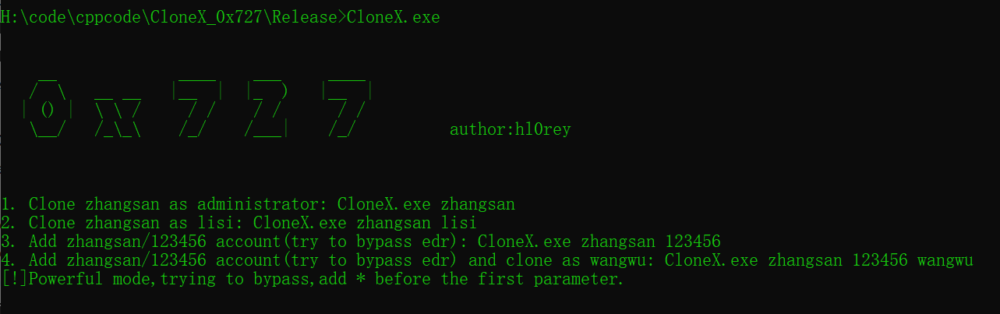
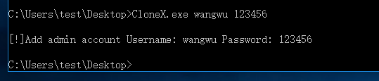
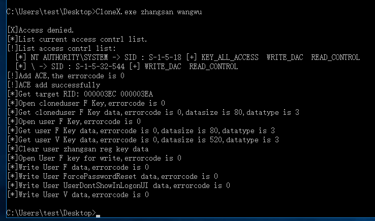
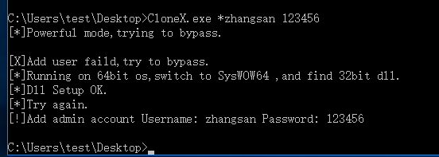

# 仓库名称

[English](./README_en.md) | [中文简体](./README.md)

| 类别 | 说明 |
| ---- | --- |
| 作者 | hl0rey |
| 团队 | [0x727](https://github.com/0x727) ，未来一段时间将陆续开源工具 |
| 定位 | 进行账户安全进行安全检测的工具 |
| 语言 | C++ |
| 功能 | 支持添加用户、克隆用户和基本的防御绕过方法 |

进行克隆用户、添加用户等账户防护安全检测的轻巧工具

## 什么是 CloneX ?

在命令行下进行添加用户、克隆用户操作的安全检测工具

## Why CloneX ?

原本是为了在利用MS17010漏洞时，直接克隆用户，让新加的用户不受Remote UAC限制，在限制条件下可以进行进一步的操作。后来将payload整理为单独工具，轻巧无依赖可单独使用。

## 快速开始体验

### 1. 源码手动安装

使用virtual studio直接编译即可

> 注意事项：
>
> 要编译为x86程序

### 2. 下载二进制安装

下载Release版本即可

## 使用方法

帮助信息给出了四个例子，涵盖了工具的四个功能，每个需要添加用户的功能都有相应的powerful mode，一共六种组合。

1. 新建用户

2. 克隆存在的用户

2. powerful mode

> 注意目前并没有内置恢复的手段，操作之前需要注意，尽量克隆自己添加的用户

## 为 CloneX 做贡献

CloneX 是一个免费且开源的项目，我们欢迎任何人为其开发和进步贡献力量。

- 在使用过程中出现任何问题，可以通过 issues 来反馈。
- Bug 的修复可以直接提交 Pull Request 到 dev 分支。
- 如果是增加新的功能特性，请先创建一个 issue 并做简单描述以及大致的实现方法，提议被采纳后，就可以创建一个实现新特性的 Pull Request。
- 欢迎对说明文档做出改善，帮助更多的人使用 CloneX，特别是英文文档。
- 贡献代码请提交 PR 至 dev 分支，master 分支仅用于发布稳定可用版本。
- 如果你有任何其他方面的问题或合作，欢迎发送邮件至 0x727Team@gmail.com 。

> 提醒：和项目相关的问题最好在 issues 中反馈，这样方便其他有类似问题的人可以快速查找解决方法，并且也避免了我们重复回答一些问题。

## Stargazers over time

